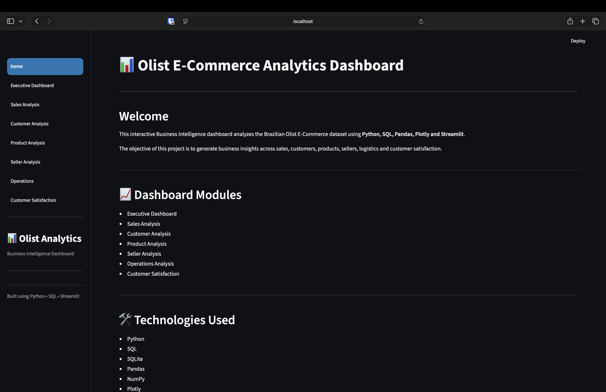
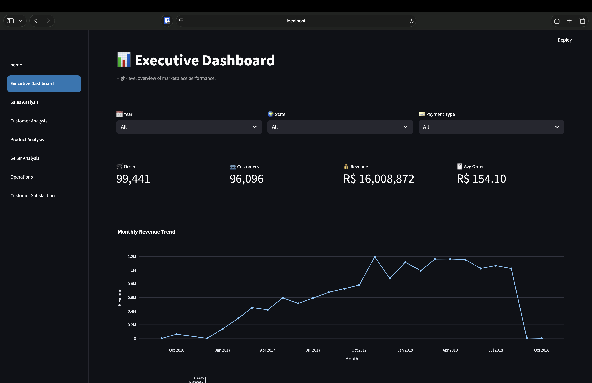
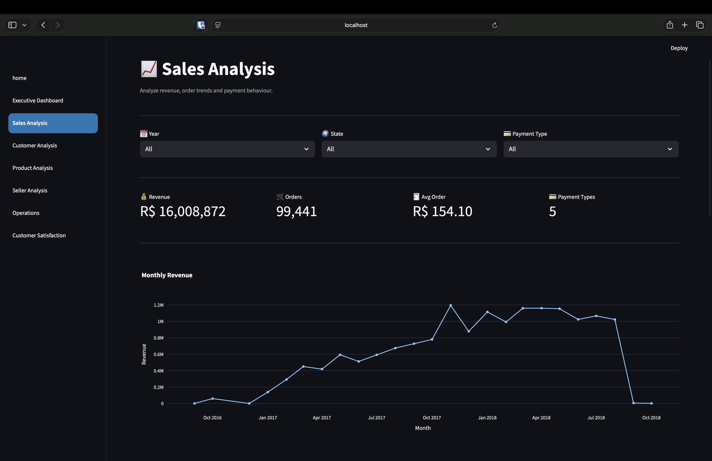
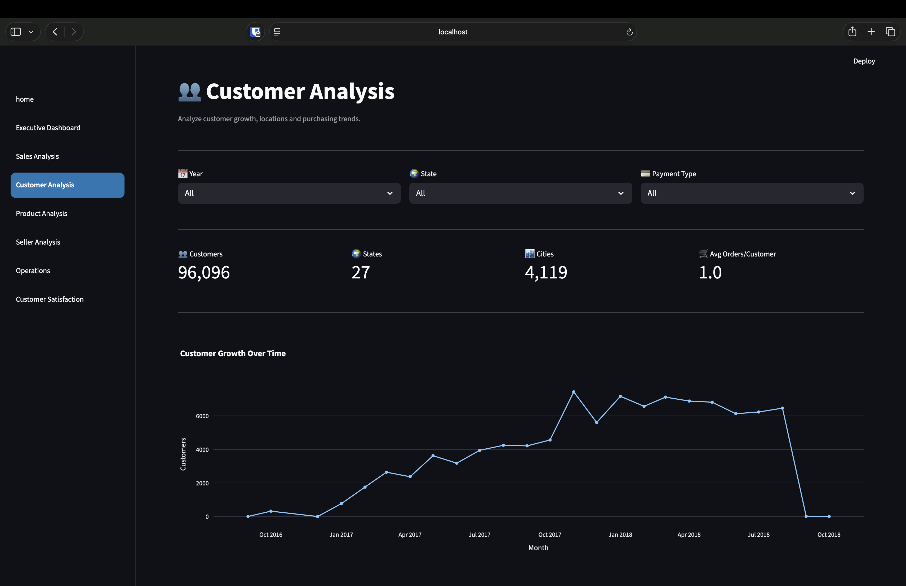
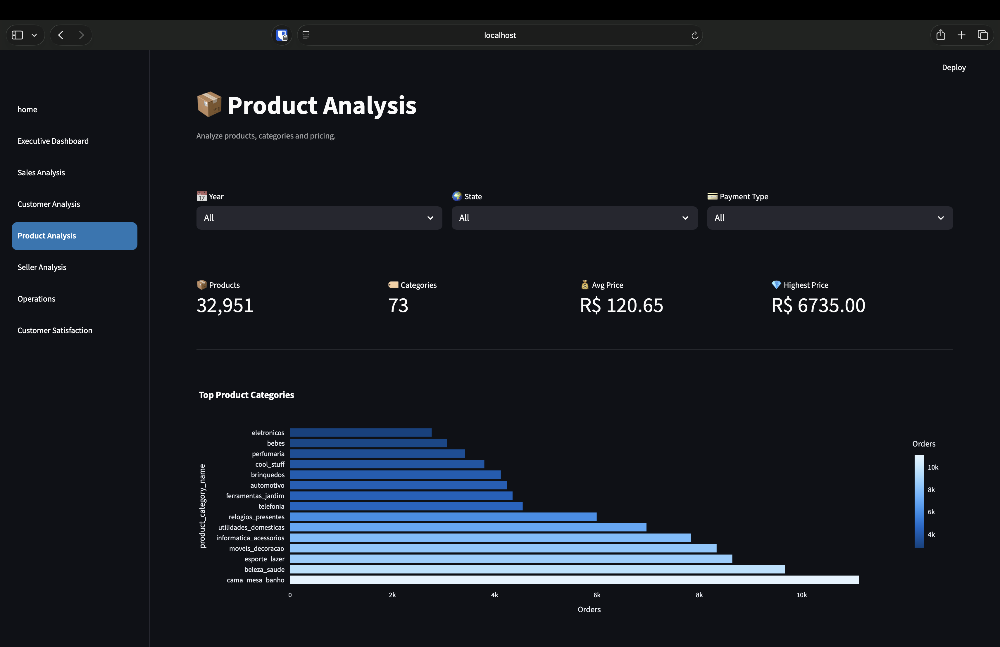
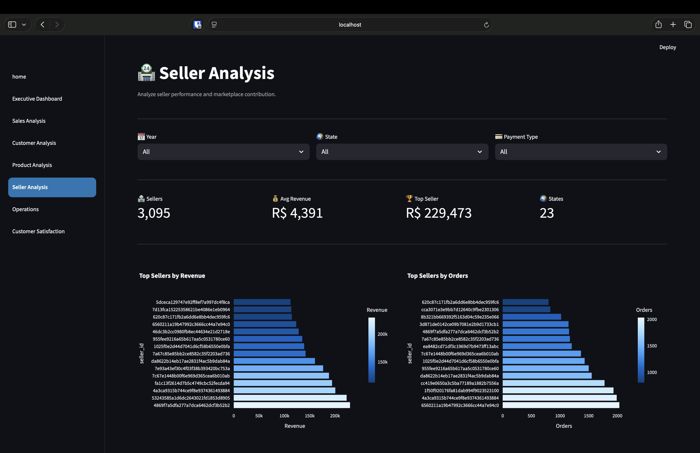
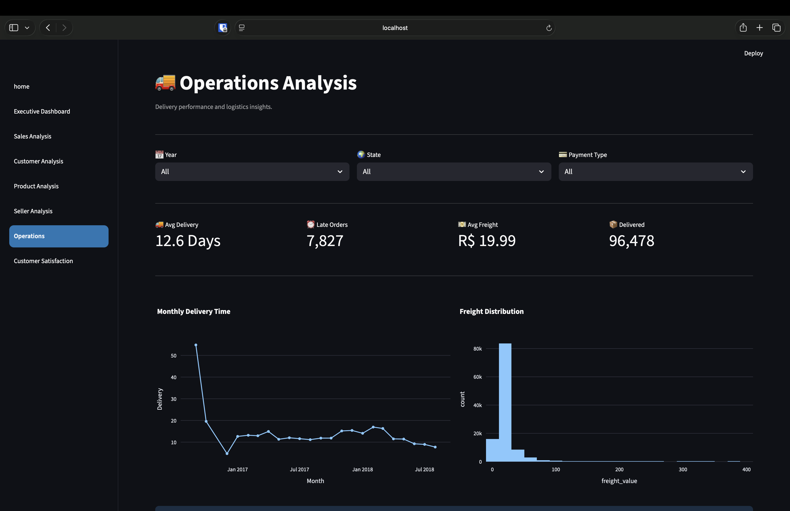
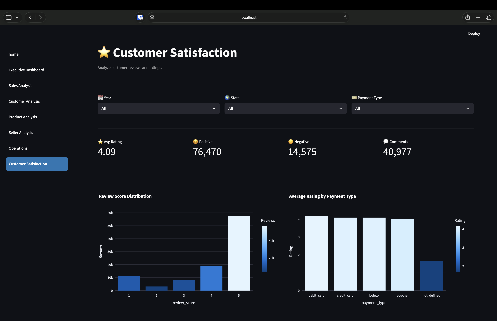

# 📊 Olist E-Commerce Analytics Dashboard

An interactive Business Intelligence dashboard built using **Python, SQL, SQLite, Plotly, and Streamlit** to analyze the Brazilian Olist E-Commerce dataset. The project provides insights into sales, customers, products, sellers, logistics, and customer satisfaction through interactive visualizations and KPI dashboards.

---

## 🚀 Project Overview

This dashboard transforms raw transactional data into actionable business insights by combining SQL-based data extraction with interactive Streamlit visualizations.

The dashboard is organized into multiple analytical modules, allowing users to explore different aspects of marketplace performance.

---

## ✨ Features

- Executive Dashboard
- Sales Analysis
- Customer Analysis
- Product Analysis
- Seller Performance
- Operations Analysis
- Customer Satisfaction Analysis

---

## 📊 Dashboard Modules

### Executive Dashboard
- Total Orders
- Revenue
- Customers
- Average Order Value
- Revenue Trend
- Order Status Distribution
- Payment Method Distribution

### Sales Analysis
- Monthly Sales Trend
- Revenue by Order Status
- Payment Type Analysis
- Monthly Revenue Table

### Customer Analysis
- Customer Distribution
- Top Customer States
- Customer Growth
- Customer Purchase Behaviour

### Product Analysis
- Top Product Categories
- Product Revenue
- Best Selling Products
- Category Performance

### Seller Analysis
- Top Sellers
- Revenue by Seller
- Seller Performance
- Seller Distribution

### Operations Analysis
- Delivery Time Analysis
- Shipping Performance
- Order Status Analysis
- Logistics KPIs

### Customer Satisfaction
- Review Score Distribution
- Ratings Analysis
- Review Trends
- Satisfaction KPIs

---

## 🛠 Technology Stack

| Category | Technologies |
|-----------|--------------|
| Programming | Python |
| Database | SQLite |
| Query Language | SQL |
| Data Analysis | Pandas, NumPy |
| Visualization | Plotly |
| Dashboard | Streamlit |

---

## 📁 Project Structure

```text
olist-ecommerce-analytics/
│
├── dashboard/
│   ├── app.py
│   ├── components.py
│   ├── config.py
│   ├── styles.py
│   ├── utils.py
│   ├── queries.py
│   └── pages/
│       ├── 1_Executive_Dashboard.py
│       ├── 2_Sales_Analysis.py
│       ├── 3_Customer_Analysis.py
│       ├── 4_Product_Analysis.py
│       ├── 5_Seller_Analysis.py
│       ├── 6_Operations.py
│       └── 7_Customer_Satisfaction.py
│
├── data/
├── images/
├── reports/
├── requirements.txt
└── README.md
```

---

## 📈 Dataset

This project uses the **Brazilian Olist E-Commerce Dataset**, containing approximately:

- 99,000+ Orders
- 96,000+ Customers
- 112,000+ Order Items
- 32,000+ Sellers
- 3,000+ Product Categories

---

## 🎯 Business Objectives

- Analyze sales performance
- Identify customer purchasing patterns
- Evaluate seller performance
- Discover top-performing products
- Monitor logistics efficiency
- Measure customer satisfaction

---

## ▶️ Installation

Clone the repository

```bash
git clone https://github.com/saniachhillar/olist-ecommerce-analytics.git
```

Move into the project

```bash
cd olist-ecommerce-analytics
```

Install dependencies

```bash
pip install -r requirements.txt
```

Run the dashboard

```bash
streamlit run dashboard/app.py
```

---

## 📷 Dashboard Preview

### Home



---

### Executive Dashboard



---

### Sales Analysis



---

### Customer Analysis



---

### Product Analysis



---

### Seller Analysis



---

### Operations



---

### Customer Satisfaction



---

## 👩‍💻 Author

**Sania Chhillar**

B.Tech (ECE-AI)  
Data Analytics | Business Intelligence | SQL | Python | Streamlit | Power BI

---

## ⭐ Future Improvements

- Advanced filtering
- Forecasting models
- Geographical visualizations
- Customer segmentation using Machine Learning
- Deployment on Streamlit Community Cloud